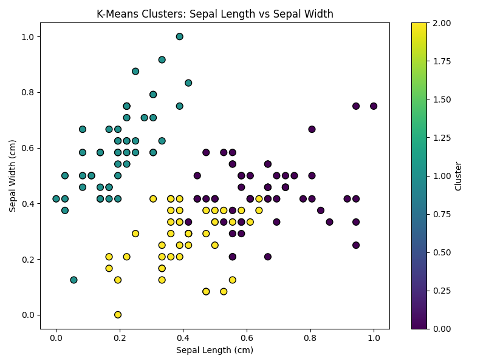
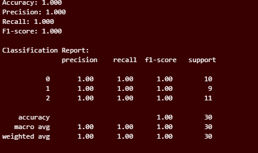

# DSA-2040_Practical_Exam_Mitchel_413

# Section 1: Data Warehousing
## Task 1 : Data Warehousing Design
***Design a star schema***
- Image : `SQL_Process/star schema.drawio.png`
- Contains a fact table and 3 dimension tables


***Explain why you choose star schema over snowflake***
- Because of its simplicity and performance benefits.
- Star schemas have fewer joins to retrieve data, making queries faster and more straight-forward to write.
- This simple structure is easier for end-users to understand and for database optimizers to execute efficiently, which is ideal for required types of analysis, such as total sales by category per quarter.

***Write SQL CREATE TABLE statement***
- File names : `retail.db`,`SQL_script.sql`
- ***Retail.db*** is the database that contains the tables created in the ***SQL file***.
- Have one fact table called ***fact_sales*** and three dimension tables; ***dim_time,dim_customer*** and ***dim_product.***

## Task 2 : ETL Process
- File name : `etl_retail.ipynb`
- Dataset : `Online Retail.csv` from UCI ML Repository.

***Extract***
- First run the necessary libraries ; ***Pandas***,***datetime***,***sqlite3***,***os***
```
# Read the Online Retail Excel file into a pandas DataFrame
file_path = r'C:\Users\Makena\OneDrive\Desktop\USIU\2nd Summer sem\DWM\End sem\DSA-2040_Practical_Exam_Mitchel_413\Data Warehousing\ETL_Process\raw\Online Retail.xlsx'
df = pd.read_excel(file_path)

# Handle missing values by dropping rows with any missing data
df_clean = df.dropna()

# Convert 'InvoiceDate' column to datetime format
df_clean['InvoiceDate'] = pd.to_datetime(df_clean['InvoiceDate'])

# Display the first few rows to verify
df_clean.head()
```
- output:
- File name: `ETL_Process/raw/df_clean.csv`


***Transform***
```
# Calculate TotalSales column
df_clean['TotalSales'] = df_clean['Quantity'] * df_clean['UnitPrice']

print('Rows after dropna:', len(df_clean))

# Remove outliers: Quantity < 0 or UnitPrice <= 0
df_clean = df_clean[(df_clean['Quantity'] >= 0) & (df_clean['UnitPrice'] > 0)]
print('Rows after removing outliers:', len(df_clean))

# Check min and max InvoiceDate
print('InvoiceDate range:', df_clean['InvoiceDate'].min(), 'to', df_clean['InvoiceDate'].max())

# Try to filter data for sales in the last year (from 2024-08-12 to 2025-08-12)
current_date = pd.Timestamp('2025-08-12')
one_year_ago = current_date - pd.Timedelta(days=365)
df_last_year = df_clean[(df_clean['InvoiceDate'] >= one_year_ago) & (df_clean['InvoiceDate'] <= current_date)]
print('Rows after date filter:', len(df_last_year))

# If no rows, use the most recent year in the data
if df_last_year.empty:
    print('No rows in the last year, using most recent year in data instead.')
    max_date = df_clean['InvoiceDate'].max()
    min_date = max_date - pd.Timedelta(days=365)
    df_last_year = df_clean[(df_clean['InvoiceDate'] >= min_date) & (df_clean['InvoiceDate'] <= max_date)]
    print('Rows in most recent year:', len(df_last_year))

# Create customer summary: total purchases and country
customer_summary = df_last_year.groupby('CustomerID').agg(
    TotalPurchases=('TotalSales', 'sum'),
    Country=('Country', 'first')
).reset_index()

# Display the first few rows of the customer summary
customer_summary.head()
```
- output: 
- File name: `customer_summary.csv`

***Load***
```
# Create SQLite database and load data into fact and dimension tables
import os

# Define absolute database file path
db_dir = r'C:\Users\Makena\OneDrive\Desktop\USIU\2nd Summer sem\DWM\End sem\DSA-2040_Practical_Exam_Mitchel_413\Data Warehousing\ETL_Process'
db_path = os.path.join(db_dir, 'retail_dw.db')

# Ensure the directory exists
os.makedirs(db_dir, exist_ok=True)

# Remove existing database for a clean start (optional)
if os.path.exists(db_path):
    os.remove(db_path)

conn = sqlite3.connect(db_path)

# Prepare CustomerDim
customer_dim = customer_summary[['CustomerID', 'Country']].drop_duplicates().copy()
customer_dim.to_sql('CustomerDim', conn, index=False, if_exists='replace')

# Prepare TimeDim
time_dim = df_last_year[['InvoiceDate']].drop_duplicates().copy()
time_dim['TimeID'] = time_dim['InvoiceDate'].astype(str)
time_dim['Year'] = time_dim['InvoiceDate'].dt.year
time_dim['Month'] = time_dim['InvoiceDate'].dt.month
time_dim['Day'] = time_dim['InvoiceDate'].dt.day
time_dim.to_sql('TimeDim', conn, index=False, if_exists='replace')

# Prepare SalesFact
sales_fact = df_last_year[['InvoiceNo', 'StockCode', 'CustomerID', 'Quantity', 'UnitPrice', 'TotalSales', 'InvoiceDate']].copy()
sales_fact['TimeID'] = sales_fact['InvoiceDate'].astype(str)
sales_fact.to_sql('SalesFact', conn, index=False, if_exists='replace')

conn.close()
print(f'Data loaded into SQLite database: {db_path}')

```
- Export the codes into CSV files 
```
# Export the contents of the SQLite tables to CSV files

# Define database file path
db_path = r'C:\Users\Makena\OneDrive\Desktop\USIU\2nd Summer sem\DWM\End sem\DSA-2040_Practical_Exam_Mitchel_413\Data Warehousing\ETL_Process\retail_dw.db'

conn = sqlite3.connect(db_path)

# Export SalesFact
sales_fact_df = pd.read_sql_query('SELECT * FROM SalesFact', conn)
sales_fact_df.to_csv('SalesFact.csv', index=False)

# Export CustomerDim
customer_dim_df = pd.read_sql_query('SELECT * FROM CustomerDim', conn)
customer_dim_df.to_csv('CustomerDim.csv', index=False)

# Export TimeDim
time_dim_df = pd.read_sql_query('SELECT * FROM TimeDim', conn)
time_dim_df.to_csv('TimeDim.csv', index=False)

conn.close()
print('CSV files generated: SalesFact.csv, CustomerDim.csv, TimeDim.csv')
```
- output: 
- File name: `ET_Process/final/CustomerDim.csv`,`TimeDim.csv`,`SalesFacts.csv`

***Full ETL and loggging***
```
def full_etl_process(excel_path, db_path):
    import pandas as pd
    import sqlite3
    import os

    print('Starting ETL process...')

    # Extraction
    df = pd.read_excel(excel_path)
    print(f'Rows after extraction: {len(df)}')

    # Drop missing values
    df_clean = df.dropna()
    print(f'Rows after dropna: {len(df_clean)}')

    # Convert InvoiceDate to datetime
    df_clean['InvoiceDate'] = pd.to_datetime(df_clean['InvoiceDate'])

    # Transformation
    df_clean['TotalSales'] = df_clean['Quantity'] * df_clean['UnitPrice']
    df_clean = df_clean[(df_clean['Quantity'] >= 0) & (df_clean['UnitPrice'] > 0)]
    print(f'Rows after removing outliers: {len(df_clean)}')

    # Filter for last year or most recent year if empty
    current_date = pd.Timestamp('2025-08-12')
    one_year_ago = current_date - pd.Timedelta(days=365)
    df_last_year = df_clean[(df_clean['InvoiceDate'] >= one_year_ago) & (df_clean['InvoiceDate'] <= current_date)]
    if df_last_year.empty:
        max_date = df_clean['InvoiceDate'].max()
        min_date = max_date - pd.Timedelta(days=365)
        df_last_year = df_clean[(df_clean['InvoiceDate'] >= min_date) & (df_clean['InvoiceDate'] <= max_date)]
        print('No rows in last year, using most recent year in data.')
    print(f'Rows after date filter: {len(df_last_year)}')

    # Customer summary
    customer_summary = df_last_year.groupby('CustomerID').agg(
        TotalPurchases=('TotalSales', 'sum'),
        Country=('Country', 'first')
    ).reset_index()
    print(f'Rows in customer summary: {len(customer_summary)}')

    # Prepare dimension and fact tables
    customer_dim = customer_summary[['CustomerID', 'Country']].drop_duplicates().copy()
    time_dim = df_last_year[['InvoiceDate']].drop_duplicates().copy()
    time_dim['TimeID'] = time_dim['InvoiceDate'].astype(str)
    time_dim['Year'] = time_dim['InvoiceDate'].dt.year
    time_dim['Month'] = time_dim['InvoiceDate'].dt.month
    time_dim['Day'] = time_dim['InvoiceDate'].dt.day
    sales_fact = df_last_year[['InvoiceNo', 'StockCode', 'CustomerID', 'Quantity', 'UnitPrice', 'TotalSales', 'InvoiceDate']].copy()
    sales_fact['TimeID'] = sales_fact['InvoiceDate'].astype(str)

    print(f'Rows in SalesFact: {len(sales_fact)}')
    print(f'Rows in CustomerDim: {len(customer_dim)}')
    print(f'Rows in TimeDim: {len(time_dim)}')

    # Load to SQLite
    db_dir = os.path.dirname(db_path)
    os.makedirs(db_dir, exist_ok=True)
    if os.path.exists(db_path):
        os.remove(db_path)
    conn = sqlite3.connect(db_path)
    customer_dim.to_sql('CustomerDim', conn, index=False, if_exists='replace')
    time_dim.to_sql('TimeDim', conn, index=False, if_exists='replace')
    sales_fact.to_sql('SalesFact', conn, index=False, if_exists='replace')
    conn.close()
    print(f'Data loaded into SQLite database: {db_path}')

    # Export to CSV
    customer_dim.to_csv('CustomerDim.csv', index=False)
    time_dim.to_csv('TimeDim.csv', index=False)
    sales_fact.to_csv('SalesFact.csv', index=False)
    print('CSV files generated: SalesFact.csv, CustomerDim.csv, TimeDim.csv')
```

## Task 3 : OLAP Queries and Analysis
***Write and execute 3 OLAP-style SQL queries***
- File name : `olap_queries.sql`
- ***Roll-up***:
- Total sales by country and quarter


- ***Drill-down***:
- Sales details for a specific country by month (example: Netherlands)


- ***Slice***:
- Total sales for electronics category (assuming StockCode for electronics contains 'ELECTRONICS')
- It has no values. 

***Visualize one query result***
- File name : `olap_visual.ipynb`
- Used the drill-down : Sales details for a specific country by month (example: Netherlands)


***Analyze results***
- File name: `report.md`

# Section 2 : Data Mining
## Task 1 : Data Preprocessing and Exploration
- File name: `preprocessing_iris.ipynb`

***Load the dataset in python***
- Load the iris dataset from scikit-learn in python 
- Convert to data frame and display the few rows
- Saved under csv `iris_df.csv`


***Preprocessing***
- Check for missing values
- Normalize features using Min-Max scaling
- One-hot encode the class label
- Combine scaled features and encoded target
- Saved under csv `iris_preprocessed.csv`

***Explore***
- Perform summary statistics
- Plot pairplot, correlation heatmap and boxplots(identify outliers)

- Pairplot


- Correlation heatmap


- Boxplots


***Split data***
- Split the data int train(80) and test(20)
- This was the output :***Train shape: (120, 7), Test shape: (30, 7)***

## Task 2 : Clustering
- File name : `clustering_iris.ipynb`
- Load the preprocessed data from the data preprocessing output `preprocessed_iris.csv`.
- Applied K-Means clustering from scikit-learn with k=3 (since 3 cluster)
- Fit the model on feature(exclude class) and predicted clusters and compared with actual classes using Adjusted Rand Index(ARI)
- Tries using k= 2 and k= 4 and plotted an elbow curve to justify optimal k.


- Visualized the clusters using matplotlib and the variables sepal length vs width, colored by cluster



- Analysis on cluster quality, missclassifications and real-world applications. In practice, most data points are grouped correctly, but some misclassifications occur, especially for samples near the boundaries between species. For example, the overlap between versicolor and virginica can lead to ambiguous assignments, since K-Means relies on feature similarity and does not use label information. More explanations in the report `clustering.md`

## Task 3 : Classification and Association Rule
### Part A : Classification
***1. Train a Decision Tree clasifier on train set***
- Predict on test set;compute accuracy, precision, recall, F1-score



- Visualize the tree


***2. Compare with another classifier (KNN) and report which is better***
```
KNN Accuracy: 1.000
KNN Precision: 1.000
KNN Recall: 1.000
KNN F1-score: 1.000

KNN Classification Report:
               precision    recall  f1-score   support

           0       1.00      1.00      1.00        10
           1       1.00      1.00      1.00         9
           2       1.00      1.00      1.00        11

    accuracy                           1.00        30
   macro avg       1.00      1.00      1.00        30
weighted avg       1.00      1.00      1.00        30

Both classifiers perform equally well on this test set.
```

### Part B : Association Rule 
***Generate transactional data***
```Transaction
0                [rice, tomatoes, chips, milk, eggs]
1              [apples, cheese, diapers, milk, eggs]
2                          [chicken, apples, cheese]
3  [butter, bread, apples, chips, bananas, yogurt...
4          [juice, beer, tomatoes, lettuce, diapers]
```

***1. Apply Apriori algorithm***
- Find rules with min_support = 0.2, min_confidence=0.5
- Sort by lift and display top 5 rules
```
antecedents consequents   support  confidence      lift
6    (cheese)      (eggs)  0.294118    0.714286  1.868132
7      (eggs)    (cheese)  0.294118    0.769231  1.868132
3      (milk)     (bread)  0.294118    0.588235  1.818182
4     (bread)      (milk)  0.294118    0.909091  1.818182
5    (cereal)   (diapers)  0.235294    0.800000  1.431579
```
- Visualization of the rule analysis


***2. Analyze : Discuss one rule's implications***
- One of the key links discovered could be: ***{milk} → {bread}***, with a high ***level of support, trust, and lift***. This principle suggests that consumers who purchase dairy products tend to also purchase bread, and this probability is considerably higher than chance ( as  evidenced  by  the  lift  assessment  ).  
- In a retail setting , this perspective can guide store design and promotions —placing dairy and bread products next   to  each  other  or  grouping  them  in  sales  can  increase  sales  .  Additionally  , it aids   in  inventory  planning  ,  ensuring  that  both  products  are  stocked  together  to  meet  customer  demand  .  These  rules  are  useful  for  cross  -  selling  strategies  and  for  improving  the  overall  shopping  experience  .

